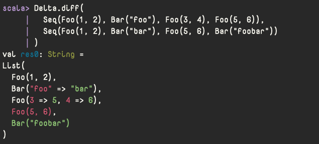

# lite-delta

> Computes a structual diff between two values.

[](https://search.maven.org/artifact/codes.quine.labo/lite-delta_2.13)

## Install

Insert the following to your `build.sbt`.

```sbt
libraryDependencies += "codes.quine.labo" %% "lite-delta" % "<latest version>"
```

## Usage

`Delta.diff` computes a diff between two any values and returns a prettified string of this diff.

For example:

```scala
import codes.quine.labo.lite.delta.Delta

sealed abstract class FooBar
case class Foo(x: Int, y: Int) extends FooBar
case class Bar(z: String) extends FooBar

Delta.diff(
  Seq(Foo(1, 2), Bar("foo"), Foo(3, 4), Foo(5, 6)),
  Seq(Foo(1, 2), Bar("bar"), Foo(5, 6), Bar("foobar"))
)
```

Screenshot:


